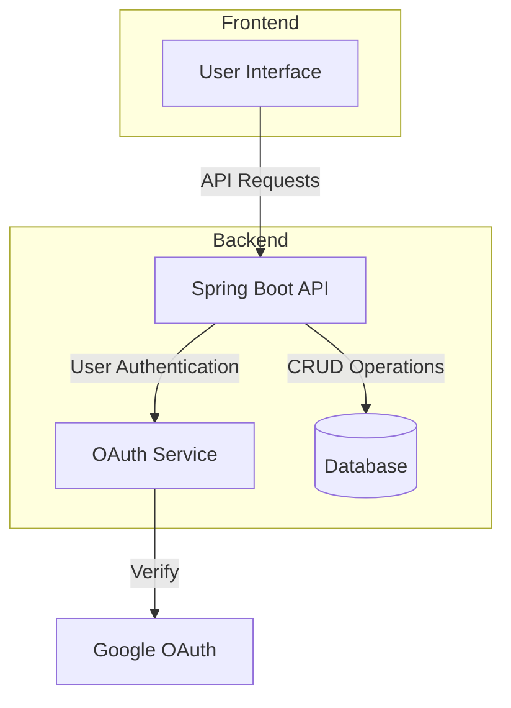
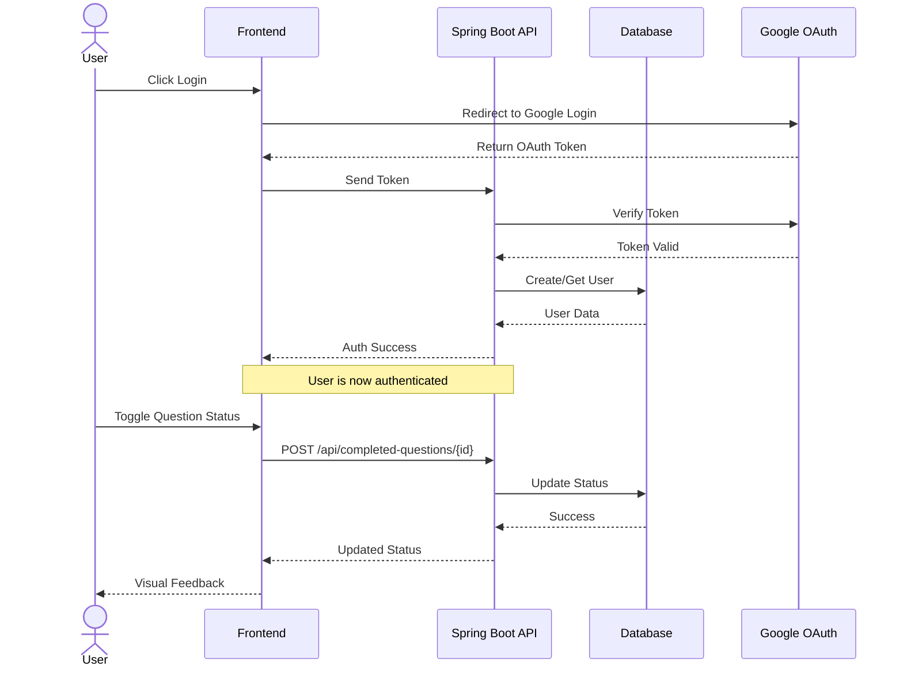
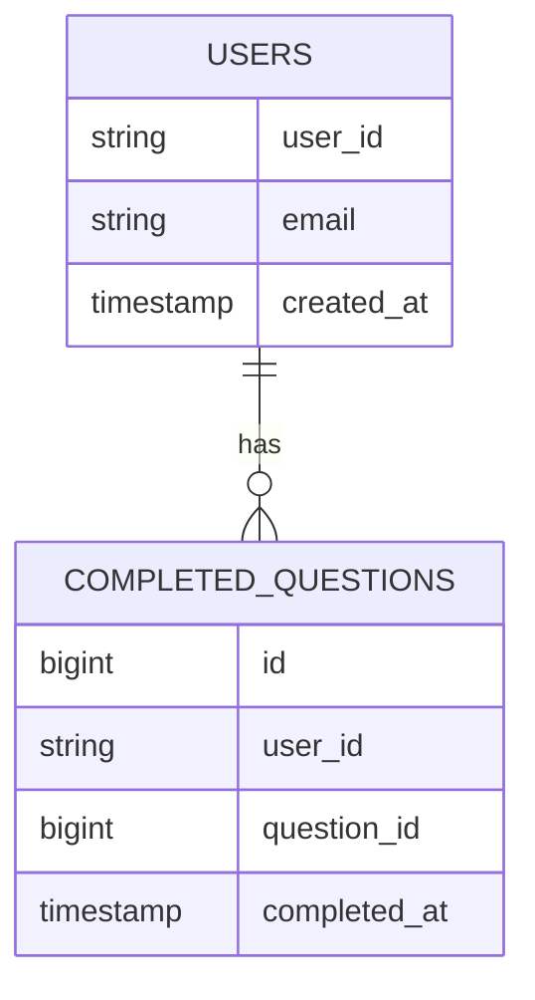

# Pattern Tracker

Pattern Tracker is a Java-based web application designed to help developers track their progress through advanced coding interview questions. 
Users can mark questions as completed or uncompleted, helping them organize their interview preparation journey.

## System Architecture



## Authentication Flow



## Database Schema



## Features

- 📝 Track completion status of coding interview questions
- 🔒 Secure authentication using Google OAuth
- ✨ Easy-to-use API endpoints
- 🔄 Toggle question completion status
- 📊 View all completed questions

## Technologies Used

- **Backend Framework:** Spring Boot
- **Authentication:** OAuth2 (Google)
- **Database:** JPA/Hibernate
- **Build Tool:** Maven
- **Language:** Java

## System Requirements

- Java 17 or higher
- Maven 3.6.x or higher
- MySQL/PostgreSQL database

## Setup and Installation

1. Clone the repository:
   ```bash
   git clone https://github.com/s0oraj/pattern-tracker.git
   cd pattern-tracker
   ```

2. Configure `application.properties`:
   ```properties
   spring.datasource.url=jdbc:mysql://localhost:3306/pattern_tracker
   spring.datasource.username=your_username
   spring.datasource.password=your_password
   ```

3. Configure OAuth2 credentials:
   - Create a project in Google Cloud Console
   - Set up OAuth 2.0 credentials
   - Add the credentials to `application.properties`

4. Build and run the application:
   ```bash
   ./mvnw spring-boot:run
   ```

## API Endpoints

### Get Completed Questions
```http
GET /api/completed-questions
```
Returns a list of completed question IDs for the authenticated user.

### Toggle Question Completion
```http
POST /api/completed-questions/{questionId}
```
Toggles the completion status of a specific question.

## Security

- Authentication is handled via Google OAuth2
- Each user's progress is private and secured
- All API endpoints require authentication

## Contributing

1. Fork the repository
2. Create your feature branch (`git checkout -b feature/AmazingFeature`)
3. Commit your changes (`git commit -m 'Add some AmazingFeature'`)
4. Push to the branch (`git push origin feature/AmazingFeature`)
5. Open a Pull Request

## License

This project is licensed under the MIT License - see the LICENSE file for details.

## Author

- [@s0oraj](https://github.com/s0oraj)

## Support

For support, email [your-email@domain.com] or create an issue in the repository.

---

Made with ❤️ for the coding interview preparation community
